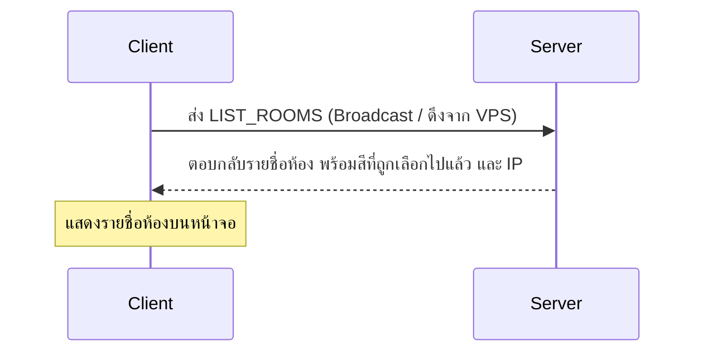
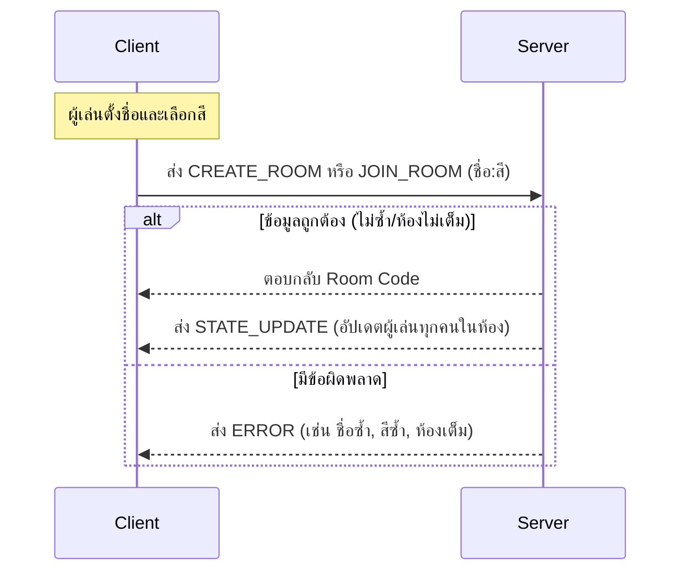
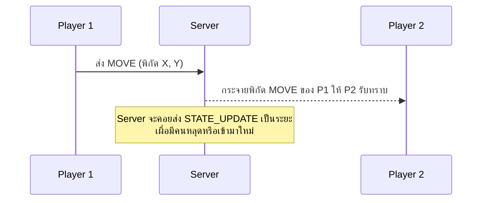

# Game Network Project

โปรเจกต์พัฒนาด้วย Pygame-CE ใช้การเชื่อมต่อผ่านโปรโตคอล **UDP** ตัวเกมรองรับผู้เล่นสูงสุด 4 คนต่อห้องและเซิร์ฟเวอร์สามารถรองรับได้สูงสุด 3 ห้อง

## System Architecture
ออกแบบให้ทำงานแบบ **Client-Server** ผสมกับแนวคิด **Peer-to-Peer (P2P)** โดยแบ่งการเล่นออกเป็น 2 โหมด:
1. **โหมด Online (Dedicated Server):** Client จะส่งข้อมูลวิ่งตรงไปยัง Server(VPS) เพื่อเล่นกับเพื่อนผ่านอินเทอร์เน็ต
2. **โหมด Local (LAN / P2P):** โหมดนี้ทำงานในรูปแบบ **Listen Server** เมื่อผู้เล่นกด "สร้างห้อง (Local)" เครื่องของผู้เล่นจะตั้งตัวเป็น Host (Server) และ Client ในเวลาเดียวกัน เพื่อนคนอื่นๆ ในวง LAN จะสามารถพุ่งตรงเข้ามาเชื่อมต่อกับเครื่อง Host ได้โดยตรงผ่าน Local IP (ใช้ UDP Broadcast หาห้องอัตโนมัติ) ทำให้สามารถเล่นด้วยกันได้โดยไม่ต้องพึ่งพาเซิร์ฟเวอร์กลางหรืออินเทอร์เน็ตภายนอก

---

## Program Flow

### 1. การค้นหาห้อง

### 2. การสร้างและเข้าร่วมห้อง

### 3. การเล่นเกม

---

## โครงสร้างแพ็กเก็ต
เนื่องจากเกมใช้ **UDP** ซึ่งเน้นความเร็ว แพ็กเก็ตจึงถูกออกแบบมาให้มีขนาดเล็กและเบาที่สุด โดยมีโครงสร้างดังนี้:

### **Header (15 Bytes)**
- `MAGIC_NUMBER` (2 Bytes): ตรวจสอบว่าเป็นแพ็กเก็ตของเกมนี้จริงๆ (0x8750)
- `SESSION_ID` (4 Bytes): รหัสเซสชันของผู้เล่น ป้องกันข้อมูลแปลกปลอม
- `PLAYER_ID` (2 Bytes): ไอดีประจำตัวผู้เล่น
- `PACKET_TYPE` (1 Byte): ประเภทของคำสั่ง (ดูด้านล่าง)
- `TARGET_TYPE` (1 Byte): เป้าหมายปลายทาง (0x00=SERVER, 0x01=ROOM)
- `SEQUENCE_NUM` (4 Bytes): ลำดับแพ็กเก็ตป้องกันการส่งซ้ำ
- `PAYLOAD_LENGTH` (1 Byte): ขนาดของข้อมูล Payload ที่จะตามมา

### **Packet Types (`config.py`)**
| Type | ชื่อคำสั่ง | หน้าที่ |
|:---:|:---|:---|
| `0x01` | **CREATE_ROOM** | ขอสร้างห้องใหม่ พร้อมส่ง ชื่อและสี ไปให้ Server |
| `0x02` | **JOIN_ROOM** | ขอเข้าร่วมห้อง พร้อมส่ง รหัสห้อง, ชื่อ, สี ไปให้ Server |
| `0x08` | **MOVE** | ส่งพิกัด (X, Y) ไปอัปเดตให้คนในห้องรู้ (ส่งรัวๆ ทุกเฟรม) |
| `0x09` | **STATE_UPDATE**| Server ส่งข้อมูลอัปเดตสถานะ (ใครอยู่ตรงไหน สีอะไร) ให้ทุกคนในห้อง |
| `0x0A` | **ERROR** | แจ้งเตือนข้อผิดพลาด (เช่น 0x02 = ห้องเต็ม, 0x06 = ห้องในเซิร์ฟเวอร์เต็มขีดจำกัด) |
| `0x0B` | **LEAVE_ROOM** | แจ้ง Server ว่าผู้เล่นกดออกจากห้อง |
| `0x0C` | **LIST_ROOMS** | ร้องขอรายชื่อห้องที่เปิดอยู่ทั้งหมดในระบบ |

---

## Log 
- **Server:** ซ่อนแพ็กเก็ตการเดิน (`MOVE`) เพื่อไม่ให้ Log ไหลเร็วเกินไปและจะแสดงเฉพาะข้อมูล เช่น การสร้างห้อง, เข้าร่วมห้อง, ออกจากห้องและแสดง IP ของผู้ส่ง
- **Client:** แสดง Log ทุกแพ็กเก็ตที่วิ่งผ่านเข้า-ออก
